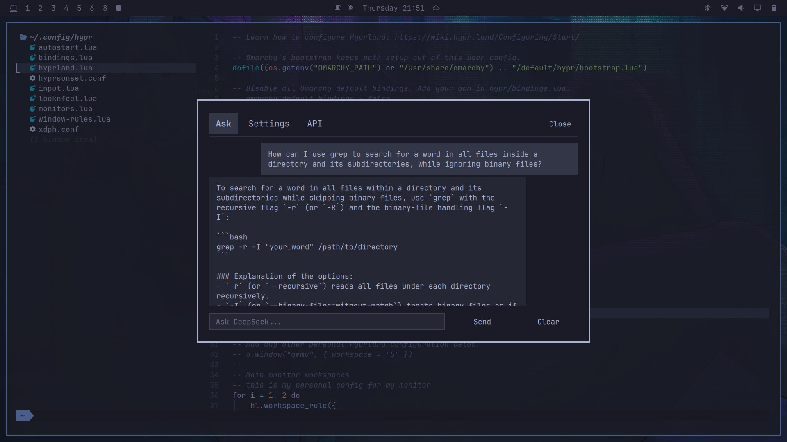
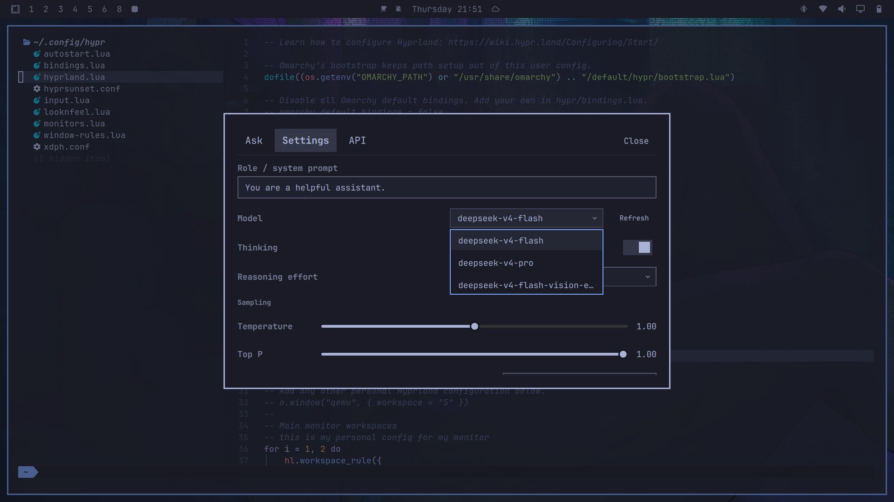
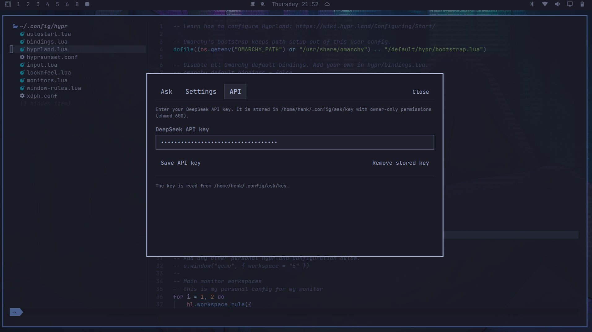

# Ask DeepSeek

Chat with DeepSeek from your desktop — ask a question and get an answer, with the conversation shown as a scrollable thread.

- Threaded conversation: each question paired with its answer
- Double-click a question or answer to copy it to the clipboard
- Optional conversation history for follow-up context
- Live model list from DeepSeek (Settings - Refresh)
- API key stored locally with owner-only permissions (API tab)

## Install

```sh
omarchy plugin add https://github.com/henksys/omarchy-ask-deepseek.git --enable
```

## Usage

To configure `SUPER + A` as your short-key to run the "Deepseek Ask" panel, Add the following lines to your ~/.config/hypr/bindings.lua ( user keybindings) file:

```sh
-- Ask DeepSeek panel (omarchy-ask-deepseek plugin)
o.bind("SUPER + A", "Ask DeepSeek", "omarchy-shell shell toggle io.github.henksys.ask")
```


Then press `SUPER + A` to open the panel (or summon it from any launcher):

```sh
omarchy-shell shell toggle io.github.henksys.ask
```

- Type a question and press Enter (or click Send).
- The conversation is shown as a thread: each question with its answer.
- **Double-click** a question or answer to copy it to the clipboard.
- Escape or the Close button closes the panel.
- **Clear** empties the conversation and deletes the history file.

### Settings tab

Opens from the panel header. You can change:

- **Role / system prompt**
- **Model** (fetched live from DeepSeek; use **Refresh** to update the list)
- **Thinking** mode and **Reasoning effort**
- **Temperature** and **Top P**
- **Output format** (text or json_object)
- **Save conversation history** (on/off)
- **Restore defaults** resets the config and clears history

Changes are saved to `~/.config/ask/config` and apply immediately.

### API tab

Enter or change your DeepSeek API key in the **API** tab (panel header). The
key is saved to `~/.config/ask/key` with owner-only permissions (`chmod 600`),
and the **Remove stored key** button deletes it. 

## Configuration

Files shared with the terminal `ask` script:

| File | Purpose |
|------|---------|
| `~/.config/ask/config` | Settings (JSON, editable in the panel or by hand) |
| `~/.config/ask/key` | DeepSeek API key (managed from the **API** tab) |
| `~/.local/share/ask/history.jsonl` | Conversation history (JSONL, one message per line) |

The DeepSeek API key is read from `~/.config/ask/key`. The file is created and
kept owner-only (`chmod 600`) when you save a key from the **API** tab.

## Remove

```sh
omarchy plugin remove io.github.henksys.ask
```

## Update

```sh
omarchy plugin update io.github.henksys.ask
```

## Requirements

- Omarchy (Hyprland + quickshell). Tested with Omarchy 4.0.1-1 and Quickshell version 0.3.1.
- curl (used for the DeepSeek API call)
- A DeepSeek API key (enter it in the **API** tab)

## Fully open code - NO binaries (except for the screenshot directory)

- This public repo contains exactly five files: Ask.qml, AskModel.js, manifest.json, README.md, LICENSE — all plain text/source.
- License: MIT (LICENSE), which is permissive — anyone can view, use, modify, and redistribute it.
- Everything is inspectable: the whole UI, the logic, and even the API call (it runs curl and parses JSON — all visible in Ask.qml/AskModel.js). There are no compiled artifacts, no obfuscation, nothing hidden.

## Security

- The API key and the conversation/request body are never passed as command-line
  arguments. The body goes to curl over stdin and the key is read by curl from a
  temporary header file (expanded from the process environment, never on a
  command line).
- Requests enforce strict limits: connect timeout 10s, transfer timeout 120s
  (chat) / 30s (models), and a hard response-size cap (10 MiB chat / 1 MiB
  models). Timed-out, oversized, and truncated responses are rejected.
- Private files (`~/.config/ask/` and `~/.local/share/ask/`) are kept at 0700
  and their config/history/key files at 0600. File access refuses symlinks and
  non-regular files, and writes are atomic (temp file + rename) so they never
  follow a symlink.

## License

MIT

## Screenshots

Chat tab:


Settings tab:



API tab:


